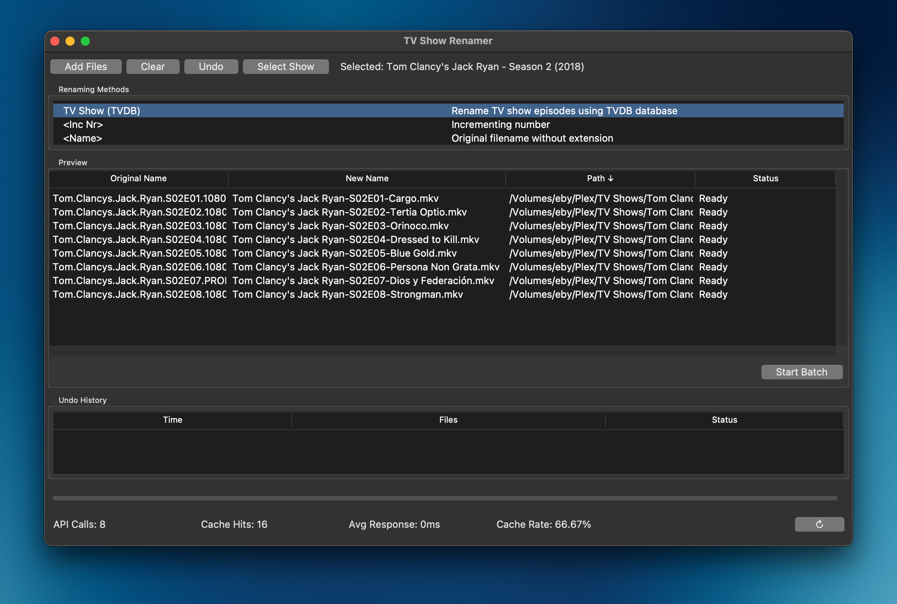

## Introduction

**TV Show Renamer** is a user-friendly application designed to help you organize and rename your TV show collection effortlessly. With a simple interface and automated features, managing your media library has never been easier.

## Installation

To get started with TV Show Renamer, follow these easy steps:

### Prerequisites

Ensure you have the following installed on your system:

- [Python 3.7+](https://www.python.org/downloads/)
- [Make](https://www.gnu.org/software/make/)

### Steps

1. **Clone the Repository**

   ```bash
   git clone https://github.com/reneboygarcia/tv_show_renamer.git
   cd tv_show_renamer
   ```

2. **Install Dependencies**

   Use the provided Makefile for easy setup:

   ```bash
   make install
   ```

   This command will:

   - Create a virtual environment
   - Install required Python packages from `requirements.txt`
   - Set up necessary configurations for the application

3. **Verify Installation**

   To confirm that all dependencies are correctly installed, run:

   ```bash
   make verify-tcltk
   ```

   This will check the Tcl/Tk installation and ensure that the environment is properly configured.

## Quick Start

Start using TV Show Renamer in no time:

1. **Activate Virtual Environment**

   ```bash
   source venv/bin/activate
   ```

2. **Run the Application**

   ```bash
   make run
   ```

3. **Follow On-Screen Instructions**

   The application will guide you through selecting your TV show directory and renaming options.

## Usage

TV Show Renamer offers a range of features to simplify your media management:

- **Automatic Renaming:** Rename your TV show files based on season and episode numbers.
- **Organize Media:** Sort your files into structured folders.
- **Customization:** Configure naming conventions as per your preference.

### Example Command

```bash
make run
```

This command launches the application, allowing you to select your TV show folder and apply renaming rules.

## Known Issues and Limitations

- **Operating Systems:** Currently supports Windows, macOS, and Linux.
- **File Formats:** Supports common video formats like `.mp4`, `.mkv`, and `.avi`.
- **Metadata Accuracy:** Relies on TMDB for metadata; discrepancies may occur if TMDB data is outdated.

## Getting Help

If you encounter any issues or have questions, feel free to reach out:

- **Open an Issue:** [GitHub Issues](https://github.com/yourusername/tv-show-renamer/issues)

## Acknowledgments

- **The Movie Database (TMDB):** For providing comprehensive media metadata.  
  [TMDB Logos Attribution](https://www.themoviedb.org/about/logos-attribution)
- **Open Source Contributors:** Thank you to all who contribute to making TV Show Renamer better!

```


