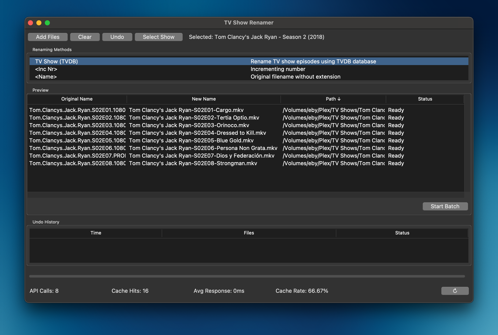

## Introduction

**TV Show Renamer** is a user-friendly application designed to help you organize and rename your TV show collection effortlessly. With a simple interface and automated features, managing your media library has never been easier.

## Installation (Windows Setup Without Makefile)

To get started with TV Show Renamer on Windows without using a Makefile, follow these steps:

### Prerequisites

Ensure you have the following installed on your system:

- [Python 3.7+](https://www.python.org/downloads/)

### Steps

1. **Clone the Repository**

   Open Command Prompt and run:

   ```bash
   git clone https://github.com/reneboygarcia/tv_show_renamer.git
   cd tv_show_renamer
   ```

2. **Create a Virtual Environment**

   In the `tv_show_renamer` directory, create a virtual environment:

   ```bash
   python -m venv venv
   ```

3. **Activate the Virtual Environment**

   ```bash
   .\venv\Scripts\activate
   ```

4. **Install Dependencies**

   With the virtual environment activated, install the required Python packages:

   ```bash
   pip install -r requirements.txt
   ```

5. **Verify Tcl/Tk Installation**

   Ensure Tcl/Tk is installed correctly by running a simple Python script:

   ```python
   python -c "import tkinter; tkinter._test()"
   ```

   This should open a small window if Tcl/Tk is installed properly.

## Quick Start

Start using TV Show Renamer:

1. **Run the Application**

   With the virtual environment still activated, run:

   ```bash
   python src/gui/main_window.py
   ```

2. **Follow On-Screen Instructions**

   The application will guide you through selecting your TV show directory and renaming options.

## Usage

TV Show Renamer offers a range of features to simplify your media management:

- **Automatic Renaming:** Rename your TV show files based on season and episode numbers.
- **Organize Media:** Sort your files into structured folders.
- **Customization:** Configure naming conventions as per your preference.

## Known Issues and Limitations

- **Operating Systems:** Currently supports Windows, macOS, and Linux.
- **File Formats:** Supports common video formats like `.mp4`, `.mkv`, and `.avi`.
- **Metadata Accuracy:** Relies on TMDB for metadata; discrepancies may occur if TMDB data is outdated.

## Getting Help

If you encounter any issues or have questions, feel free to reach out:

- **Open an Issue:** [GitHub Issues](https://github.com/yourusername/tv-show-renamer/issues)

## Acknowledgments

- **The Movie Database (TMDB):** For providing comprehensive media metadata.  
  [TMDB Logos Attribution](https://www.themoviedb.org/about/logos-attribution) 